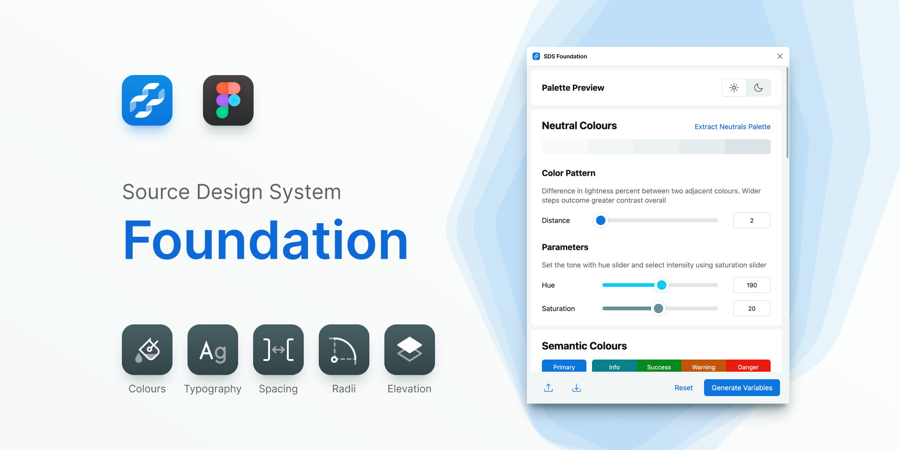
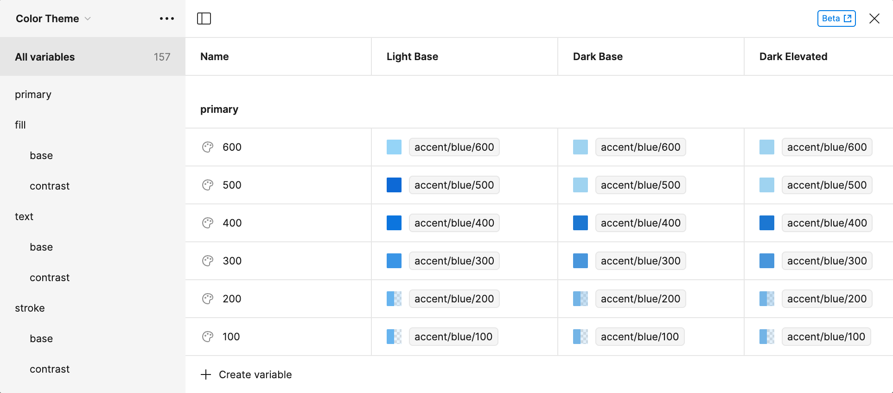



    

Figma plugin makes the design system foundation a breathe. With a simple and convinient UI you can customise every aspect of the design system and connect it with CLI generator. This tool creates Figma variables for colours, spacing, radii and typography elements like font sizes and line heights. In addition it makes text styles and effects to support various elevation levels.

    

<a href="https://www.figma.com/community/plugin/1297031341980383999/source-colors-lite" class="inline-block px-base py-xs rounded-md color-text-contrast-600 bg-primary-400 hover:no-underline hover:bg-opacity-90" target="_blank">Get Foundation Plugin</a>


